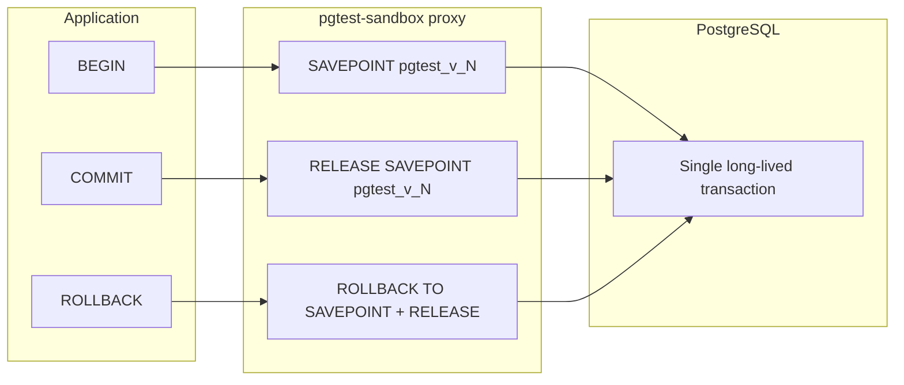

# pgtest-sandbox

**pgtest-sandbox** is a tool to manage integration and functional tests that perform database write operations (INSERT, UPDATE, DELETE). It ensures that none of these changes become permanent and that you do not need to create or maintain a separate test database.

## How it works

pgtest-sandbox runs tests inside a single long-lived database transaction:

1. It opens a single database connection to your existing PostgreSQL.
2. It starts a transaction at the beginning of the test session.
3. It keeps that same connection and transaction open while all tests run.
4. All database operations triggered by the tests are executed through this same transaction.

Because the transaction is **never committed**:

- Tests can read and depend on the writes they perform.
- The database behaves normally during execution.
- No changes are persisted outside the transaction.

When the server shuts down (gracefully) or the process is killed, the database connection is closed. Since the transaction was never committed, PostgreSQL automatically rolls it back, and the database returns to its original state.

In short: **pgtest-sandbox creates a transactional sandbox** so tests run against a real database without leaving any permanent side effects.

## Core Concept

Run real tests against a real database with zero permanent side effects.

### How you use it

1. Start pgtest-sandbox.
2. Point your tests to the proxy instead of directly to PostgreSQL.
3. Set application_name=pgtest_<testID> in your connection.
4. Run your tests normally.

That’s it.

### Why it’s different

- No separate test database.
- No database resets.
- No schema cloning.
- No cleanup scripts.
- No risk of accidental commits.

It works by isolating all test activity inside a transaction that is guaranteed to roll back.

Ideal use cases

- Integration tests
- Functional tests
- CI pipelines
- Shared development databases
- Systems where maintaining a separate test database is expensive or impractical

## Key differentiator

- **Use a real PostgreSQL database** — tests run against a real instance with a real schema, so behavior matches production closely.
- The **single long-lived transaction** ensures that from the database’s perspective nothing is ever committed; when the process ends, everything is rolled back.
- **Within a test**, you can still use normal transaction-like behavior (nested begin/commit/rollback) via the proxy’s TCL→savepoint mapping and the **pgtest commands** (see below).

## ⚠️ Use a test-only database

Even though pgtest-sandbox rolls back everything at the end, **you must point it only at a test / non‑production database**.

Why:

- pgtest keeps a **single long‑lived transaction** open. If you run **DDL** inside it (for example `ALTER TABLE`), PostgreSQL will take strong locks (often `ACCESS EXCLUSIVE`) that block other sessions on that table until the transaction finishes.
- Those locks are visible immediately to other sessions; there is no way to “hide” them inside the transaction. On a shared dev or prod database this can cause real downtime and blocked queries.
- Tests may also insert a lot of data or temporarily change constraints/indexes; even if it all rolls back, it can slow down or block other clients while tests are running.

**Recommendation:**

- Use pgtest-sandbox only against a **dedicated testing database** (or a dedicated testing cluster).
- Never point it at a production database.
- Avoid mixing pgtest traffic with critical interactive use of the same database.

## Build and run

### Go / Makefile (cross-platform)

- **Build:** `go build -o bin/pgtest-sandbox ./cmd/pgtest` or `make build` (outputs `bin/pgtest-sandbox`).
- **Run:** `./bin/pgtest-sandbox` or `make run`. Optional first argument: path to config file; otherwise config is discovered (see [Configuration](#configuration)).

### Windows .bat scripts

- **setEnvironments.bat** — Sets up the Go environment (PATH, GOROOT, etc.). Other scripts call it before running Go. Run it first in a new shell if Go is not already on PATH.
- **build.bat** — Calls `setEnvironments.bat`, then builds `bin\pgtest-sandbox.exe` with `-H windowsgui` (no console window; app lives in the system tray).
- **run.bat** — Calls `setEnvironments.bat`, then runs `bin\pgtest-sandbox.exe`.

#### Windows system tray (no console window)

On Windows, the main binary is built as a **GUI application** (no console window). When you start `pgtest-sandbox.exe`:

- A **tray icon** appears (near the clock) instead of a visible console.
- **Right‑click** the icon to:
  - **Open GUI** — launches your browser to the configured GUI URL (typically `http://<listen_host>:<listen_port>/`).
  - **Quit** — cleanly stops the proxy server and exits the app.

For debugging or logs from the console, you can still run:

- `go run ./cmd/pgtest`  
- or `go build -o bin/pgtest-sandbox.exe ./cmd/pgtest` (without `-H windowsgui`) and then run that binary from a terminal.

### Tests

- **test.bat** — Sets `PGTEST_CONFIG` (default `config\pgtest-sandbox.yaml` if unset), runs unit tests then integration tests (`-tags=integration`). Logs to `test_results_*.log`.
- **test-unit.bat** — Unit tests only; `-timeout 120s`, `-parallel 1` by default; prints a short report.
- **test-integration.bat** — Integration tests; requires a running PostgreSQL and valid config. Optional argument: test name for `-run`. Prints a short report.

Integration tests require a running PostgreSQL and a config (or environment variables) pointing at it.

## Quick start

1. **Install Go** (1.23+).
2. **Copy and edit the config** — e.g. copy `config/pgtest-sandbox.yaml` and set `postgres` (host, port, database, user, password) and `proxy` (listen_host, listen_port) to match your environment.
3. **Build and run the proxy:**  
   `make build && make run` (or on Windows: `build.bat` then `run.bat`).
4. **Point your tests at the proxy** — Use the proxy’s host and port as the database host/port in your test DSN. Set `application_name=pgtest_<testID>` so the proxy associates the connection with a session (see [Connecting from your tests](#connecting-from-your-tests)).

Your test process (e.g. PHP, Python, any PostgreSQL client) connects to the proxy; the proxy holds one long-lived transaction per testID and never commits it.

## Configuration

- **Config file:** By default the binary looks for `config/pgtest-sandbox.yaml` (relative to the working directory or next to the executable). Override with the `PGTEST_CONFIG` environment variable or by passing the config path as the first argument to the binary.
- **Structure:** The config has four main sections:
  - **postgres** — Connection to the real PostgreSQL: `host`, `port`, `database`, `user`, `password`, `session_timeout`.
  - **proxy** — How the proxy listens: `listen_host`, `listen_port`, `timeout`, `keepalive_interval`.
  - **logging** — `level` (DEBUG, INFO, WARN, ERROR), `file` (empty = stderr).
  - **test** — Optional test defaults: `schema`, `context_timeout`, `query_timeout`, `ping_timeout`.

The proxy speaks the PostgreSQL wire protocol. Clients connect to the proxy (using `proxy.listen_host` and `proxy.listen_port`); the proxy connects to the real database using the `postgres` settings and runs all commands inside a single transaction per session.

## Connecting from your tests

- Connect to the **proxy** (same host/port style as PostgreSQL).
- To associate a connection with a test session, set **application_name** to `pgtest_<testID>` (e.g. `pgtest_my_integration_test`).
- Connections with the same testID share one transaction/session; different testIDs are isolated.

Example DSN (conceptually):  
`host=localhost port=5432 user=postgres password=... dbname=mydb application_name=pgtest_suite1`

*Example for Laravel/PHP (for reference only; pgtest-sandbox is not tied to Laravel or PHP):* In Laravel you can set the DB connection for tests to use the proxy host/port and add `application_name=pgtest_<id>` in the connection options or in a test base class (e.g. in `config/database.php` for the testing connection or via `DB::connection()->getPdo()->setAttribute(...)`). Any client that can set `application_name` and connect to the proxy will work.

## pgtest commands

These are custom “queries” sent to the proxy (as a single statement). The proxy interprets them and does not forward them as normal SQL. The testID is taken from the connection’s `application_name` (`pgtest_<testID>`).

| Command | Description |
|--------|-------------|
| **pgtest begin** | Ensures a session exists for the current testID; returns success. Use to explicitly start or ensure the transactional context (e.g. after a rollback or at test start). |
| **pgtest rollback** | Rolls back the **entire** base transaction for this testID and starts a new one. Use to reset the sandbox to a clean state within the same test or before the next test. |
| **pgtest status** | Returns a result set: `test_id`, `active` (whether there is an active transaction), `level` (savepoint level), `created_at`. |
| **pgtest list** | Returns one row per session: `test_id`, `active`, `level`, `created_at`. |
| **pgtest cleanup** | Drops expired sessions (based on proxy timeout); returns a single number `cleaned`. |

Example: `db.Exec("pgtest rollback")` (or equivalent in your language) to reset the sandbox.

## TCL transformed into savepoint logic

The proxy intercepts transaction control statements and converts them into PostgreSQL savepoint operations so that the **base** transaction is never committed or rolled back from the application’s perspective; only logical “nested” transactions are.

- **BEGIN**  
  If there is no base transaction yet, the proxy ensures one is started. Then it sends **SAVEPOINT pgtest_v_N** to PostgreSQL, where **N** is the current savepoint level (1-based after the first BEGIN). The level is incremented for the next BEGIN. So: first BEGIN → base tx (if needed) + `SAVEPOINT pgtest_v_1`; second BEGIN → `SAVEPOINT pgtest_v_2`, and so on.

- **COMMIT**  
  Converted to **RELEASE SAVEPOINT pgtest_v_N** (release the current savepoint and decrement the level). If the level is already 0, no SQL is sent; the proxy returns success. The base transaction is **never** committed.

- **ROLLBACK** (plain `ROLLBACK`, not `ROLLBACK TO SAVEPOINT`)  
  If level > 0: the proxy sends **ROLLBACK TO SAVEPOINT pgtest_v_N; RELEASE SAVEPOINT pgtest_v_N** and decrements the level. If level = 0: no SQL is sent. So application ROLLBACK only undoes work since the last BEGIN (savepoint), not the whole session.

User-issued **SAVEPOINT**, **RELEASE SAVEPOINT**, and **ROLLBACK TO SAVEPOINT** are passed through and executed inside a guard so that a failure does not abort the main transaction.

